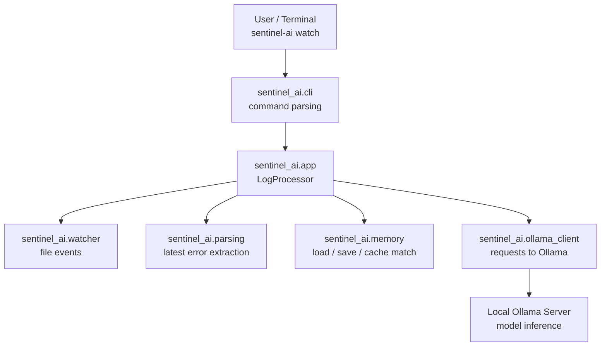
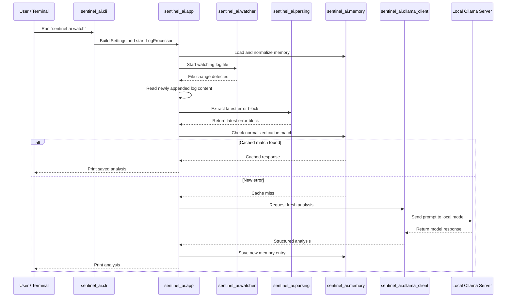
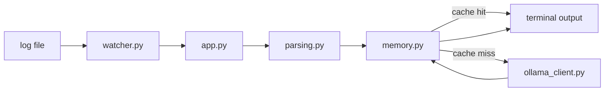

# Sentinel AI Architecture

## Purpose

Sentinel AI is a local log-watching and error-analysis tool. It watches a log file, extracts new error content, checks whether that error was already analyzed, and only calls Ollama when it needs a fresh answer.

## High-Level Flow



## Runtime Sequence



## Components

### `sentinel_ai/cli.py`

Entry point for the packaged application.

Responsibilities:

- parse CLI commands
- build runtime settings
- dispatch to `watch`, `analyze`, and `memory list`

### `sentinel_ai/config.py`

Defines configuration values in one place using the `Settings` dataclass.

Responsibilities:

- log file path
- memory file path
- Ollama API URL
- model name

### `sentinel_ai/app.py`

Contains the main orchestration logic in `LogProcessor`.

Responsibilities:

- track read position in the log
- track last processed error
- coordinate parsing, memory lookup, Ollama calls, and saving

This is the main runtime brain of the app.

### `sentinel_ai/watcher.py`

Handles file-system watching.

Responsibilities:

- listen for create/modify/move events
- normalize watched file matching
- trigger the processing callback

### `sentinel_ai/parsing.py`

Responsible for turning newly appended log text into the error block to analyze.

Current heuristic:

- split on blank lines
- use the newest block

### `sentinel_ai/memory.py`

Handles persistent cache behavior.

Responsibilities:

- load memory entries
- normalize old schema (`analysis` -> `response`)
- save memory entries
- match repeated errors using normalized text

### `sentinel_ai/ollama_client.py`

Encapsulates communication with Ollama.

Responsibilities:

- build prompt
- call Ollama API
- return structured analysis
- surface connection and timeout failures

## Data Flow



## Files And Roles

```text
pyproject.toml             package metadata and console script
sentinel_ai/cli.py         CLI entrypoint
sentinel_ai/app.py         runtime orchestration
sentinel_ai/watcher.py     filesystem watching
sentinel_ai/parsing.py     log parsing
sentinel_ai/memory.py      cache persistence and lookup
sentinel_ai/config.py      settings definition
sentinel_ai/ollama_client.py Ollama API integration
README.md                  usage and installation guide
ARCHITECTURE.md            architecture overview
```

## Why This Structure Works

- The project is now shippable as a package.
- The CLI layer is separate from the business logic.
- File watching, parsing, memory, and model calls are isolated.
- Each part can be tested independently.
- Future integrations can reuse the core package instead of rebuilding the logic.

## Future Architecture Improvements

- add a dedicated `logging` layer instead of `print`
- introduce a richer parser for stack traces and multiline errors
- add tests around `parsing.py`, `memory.py`, and `app.py`
- support alternate inference backends beyond Ollama
